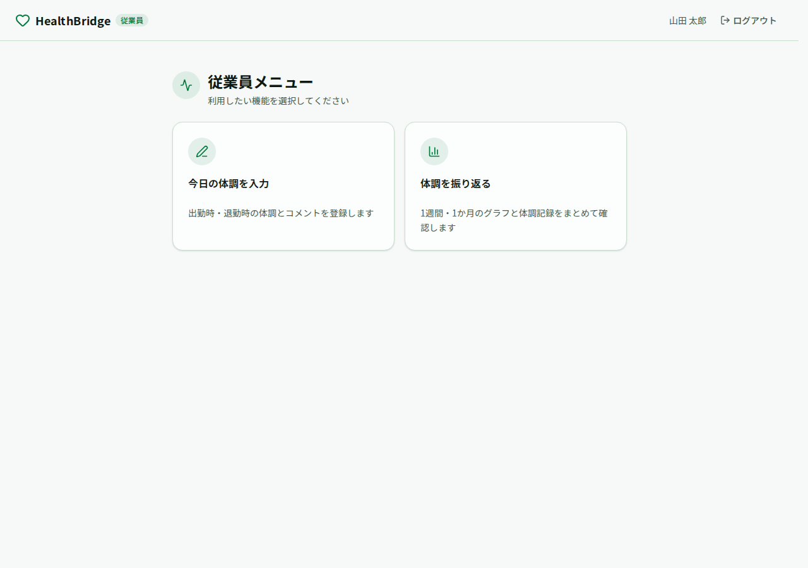
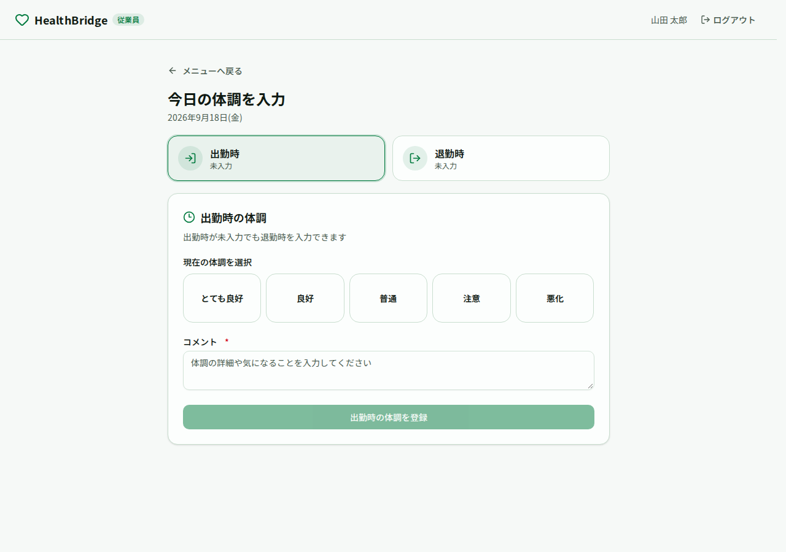
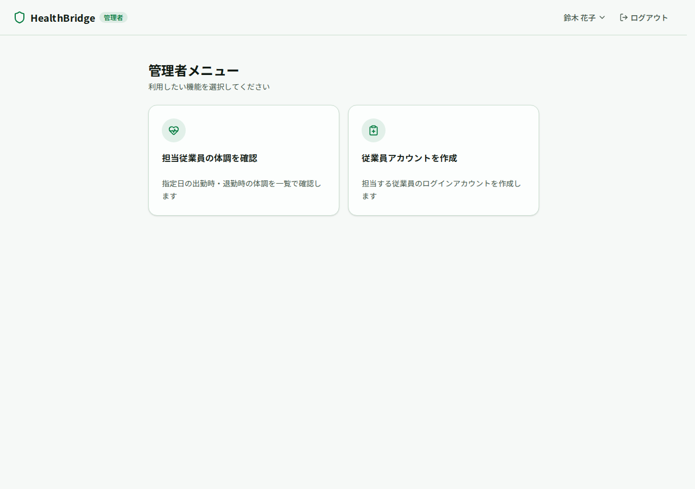
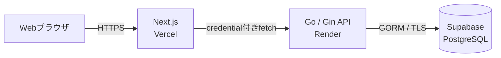

# HealthBridge

従業員が日々の体調を記録し、本人の振り返りと管理者による早期フォローを支援するWebアプリです。小さな変化を相談のきっかけにすることを目的としており、医療上の診断や治療を行うものではありません。

現在は、認証機能を本番環境へ接続済みです。体調記録や担当従業員管理などの業務画面は操作できますが、業務APIとDB保存には未接続のモックです。

## 公開アプリ・デモ

**公開URL：<https://health-bridge-management.vercel.app/>**

リポジトリをcloneせず、ブラウザから管理者・従業員それぞれの画面を確認できます。ログイン、セッション復元、role別の画面保護、ログアウトは本番APIへ接続済みです。

> [!NOTE]
> 以下は公開デモ専用のアカウントです。個人情報や実際の体調情報は入力しないでください。
> 認証機能は本番APIへ接続していますが、体調記録などの業務機能は現在モックデータで動作します。
> Renderのサービスがスリープしている場合、最初のログインに時間がかかることがあります。

| 利用者 | ログイン画面 | メールアドレス | パスワード |
| --- | --- | --- | --- |
| 管理者 | [管理者ログイン](https://health-bridge-management.vercel.app/manager/login) | `manager.demo@example.com` | `testmanager` |
| 従業員 | [従業員ログイン](https://health-bridge-management.vercel.app/employee/login) | `employee.demo@example.com` | `testemployee` |


2026年9月24日に、管理者・従業員のログイン、リロード後のセッション復元、role不一致時の403画面、ログアウト、ログアウト後の保護画面からログイン画面への遷移を本番環境で確認しました。`GET /health` のHTTP 200、Vercel Originから認証APIへのpreflightのHTTP 204、credential付きCORSも確認済みです。

## 開発背景と利用者

従業員本人は、毎日の小さな体調変化を後から振り返ることが難しく、管理者も本人から相談があるまで変化に気づきにくいことがあります。HealthBridgeは、記録を本人のセルフケアと管理者への相談のきっかけにするために開発しています。

監視を目的とせず、本人と管理者のコミュニケーションを補助することを重視しています。初期運用は従業員10名程度の小規模チームを想定しています。

| 利用者 | 主な利用場面 |
| --- | --- |
| 従業員（employee） | 出勤時・退勤時の体調を記録し、週・月単位で変化を振り返る |
| 管理者（manager） | 担当従業員の記録を確認し、声かけや配慮を検討する |

## 主な機能と現在の状態

状態は「実装済み（本番接続済み）」「モック（画面内のみ）」「未実装」で区別しています。

| 対象 | 機能 | 状態 |
| --- | --- | --- |
| 共通 | ログイン、ログアウト、セッション復元 | 実装済み（本番接続済み） |
| 共通 | role別の画面保護、認証エラー・403表示 | 実装済み（本番接続済み） |
| 従業員 | 出勤時・退勤時の体調入力 | モック（API・DB保存は未実装） |
| 従業員 | 1週間／1か月の履歴・グラフ | モック（実データ取得は未実装） |
| 管理者 | 担当従業員の一覧・絞り込み・個人詳細 | モック（業務APIは未実装） |
| 管理者 | 従業員作成・編集・無効化・担当変更 | モック（業務APIは未実装） |
| 管理者 | 管理者アカウントの作成 | 管理用CLIは実装済み。ブラウザの登録画面は公開モック |
| 業務データ | 本人・担当関係に基づく認可とDB永続化 | 未実装 |

詳しい機能要件、画面単位の状態、対象外機能は[要件定義](docs/requirements.md)にまとめています。

## デモ操作の流れ

### 従業員

1. [従業員ログイン画面](https://health-bridge-management.vercel.app/employee/login)からログインする
2. 従業員メニューを確認する
3. 体調入力画面と履歴・グラフ画面を確認する（業務データはモック）
4. ヘッダーからログアウトする

### 管理者

1. [管理者ログイン画面](https://health-bridge-management.vercel.app/manager/login)からログインする
2. 管理者メニューを確認する
3. 担当従業員一覧・個人詳細・従業員作成画面を確認する（業務データはモック）
4. ヘッダーからログアウトする

`/manager/register` は画面例を確認するための公開モックです。入力してもmanagerアカウントは作成されません。実際のアカウントは管理用CLIで作成します。

## 画面イメージ

| 従業員メニュー | 体調入力（モック） | 管理者メニュー |
| --- | --- | --- |
|  |  |  |

画面例の一覧は[要件定義の画面例](docs/requirements.md#8-画面例一覧)で確認できます。

## 技術構成とシステム構成

| 領域 | 技術・サービス | 役割 |
| --- | --- | --- |
| フロントエンド | Next.js / React / TypeScript / Tailwind CSS | role別画面、入力、一覧、グラフ、認証APIの呼び出し |
| バックエンド | Go / Gin / GORM | 認証、middleware、業務ルール、PostgreSQLアクセス |
| データベース | PostgreSQL | ユーザー、セッション、体調記録等の保存 |
| ローカル環境 | Docker / Docker Compose | Frontend・Backend・PostgreSQLの開発環境 |
| 本番環境 | Vercel / Render / Supabase PostgreSQL | Frontend・Backend・Databaseを分離して配置 |

### 主な技術の選定理由

- **Next.js / React / TypeScript**：v0で作成したUIを活用しやすく、Vercelとの親和性やフレームワークの規約に沿った開発を経験するため採用しました。
- **Tailwind CSS**：デザイン調整を効率化し、画面間で一貫したスタイルを適用しやすくするため採用しました。
- **Go / Gin**：前職の研修で学んだGoを活かしながら、routingやmiddlewareを備えたWeb API開発を実践するため採用しました。
- **PostgreSQL / GORM**：role、担当関係、体調記録などの関連を制約付きで管理し、ローカルと本番で同じDB構成を利用するため採用しました。
- **Docker Compose**：バックエンドとPostgreSQLを、環境差を抑えて再現できるようにするため採用しました。
- **Vercel / Render / Supabase**：フロントエンド、API、DBを分離し、それぞれに適したマネージドサービスで公開するため採用しました。すべてのサービスを無料枠で使用しています。



本番ではVercelの `NEXT_PUBLIC_API_BASE_URL` からRender APIを参照し、RenderからSupabase PostgreSQLへ接続します。Supabase AuthやData APIは使用せず、GoアプリケーションからPostgreSQLへ接続する構成です。

## 工夫した点・技術的な判断

- **安全なセッション認証**：パスワードはbcryptで保存し、セッショントークンはHttpOnly Cookieへ格納します。DBには平文トークンではなくSHA-256ダイジェストを保存しています。
- **分離構成でのブラウザ認証**：VercelとRenderの異なるOrigin間でCookieを扱うため、許可Originを限定したcredential付きCORSと、状態変更リクエストのOrigin検証を実装しました。
- **認証・認可の境界を明確化**：サーバー側に認証・role確認middlewareを用意し、現在の画面はフロントエンドのルートガードで保護しています。ログインにはIP・メールアドレス単位のレート制限も適用しています。
- **責務と実装状態の分離**：Goバックエンドをhandler／service／repositoryへ分け、実装済みの認証と、モック・未実装の業務機能を文書上でも区別しています。

詳細な認証フロー、DB設計、セキュリティ上の判断は[システム構成・設計](docs/architecture.md)に記載しています。

## AIツールの利用

本プロジェクトでは、要件整理、UI作成、実装、レビューの補助としてAIツールを使用しています。

| ツール | 使用範囲 |
| --- | --- |
| ChatGPT | 要件・Issueの整理、技術選定の検討、コードリーディング、エラー原因の切り分け、デプロイ手順の確認に使用しました。 |
| Codex | 実装案、テストコード、リファクタリング、ドキュメント修正の作成支援に使用しました。コードの一部はCodexによる生成を含みます。 |
| CodeRabbit | Pull Requestの自動レビューに使用し、セキュリティ、境界値、並行処理、データ整合性などの指摘を修正へ反映しました。 |
| v0 by Vercel | 初期の画面設計とUIコンポーネントのたたき台作成に使用しました。生成されたUIを本プロジェクトの要件に合わせて調整しています。 |

### 利用時の方針

- AIの出力をそのまま完成扱いにせず、差分、テスト結果、レビュー指摘を確認して採用を判断しています。
- `go test`、`go vet`、lint、build、ブラウザー操作、本番E2Eなど、変更内容に応じた検証を実施しています。
- DB接続文字列、パスワード、Cookie、APIキーなどの秘密情報は、プロンプトやリポジトリへ含めない方針で運用しています。
- 理解や判断が不十分な内容は実装済みとせず、Issueや未実装項目として分けて管理しています。

## ローカルで確認する場合

Docker、Docker Compose、Gitが必要です。詳細な環境変数、migration、ユーザー作成、テスト手順は[ローカル開発手順](docs/development.md)を参照してください。

```bash
git clone https://github.com/atamu2463/health-bridge.git
cd health-bridge
cp .default.env .env
# .env と frontend/.env.local にローカル用の値を設定
docker compose up -d --build
docker compose exec backend /usr/local/bin/migrate
```

起動後は <http://localhost:3000> を開きます。秘密情報や本番環境の値はコミットしないでください。

## 詳細ドキュメント

- [要件定義](docs/requirements.md)
  対象利用者、employee／managerの機能要件、権限、入力ルール、実装済み・モック・未実装の境界を整理しています。
- [システム構成・設計](docs/architecture.md)
  Vercel・Render・Supabaseの関係、バックエンドのレイヤー、認証・認可、API、DB・セキュリティ設計を説明しています。
- [ローカル開発手順](docs/development.md)
  Docker Composeによる起動、環境変数、migration、管理用CLI、テストと停止方法をまとめています。
- [デプロイ・運用手順](docs/deployment.md)
  本番3サービスの役割、環境変数、migration、デプロイ後の確認項目と運用上の注意をまとめています。
- [レビュー・改善履歴](docs/review-history.md)
  スタッフレビューで得た指摘、採用した判断、UI・要件へ反映した結果を記録しています。

## 今後の実装予定

- 体調記録の業務APIとPostgreSQLへの保存
- 週・月グラフの実データ取得
- 管理者向け担当従業員一覧・絞り込み・従業員作成API
- 本人・現在の担当関係に基づく業務データのサーバー側認可
- 業務画面のモック状態をAPI接続へ置き換える
