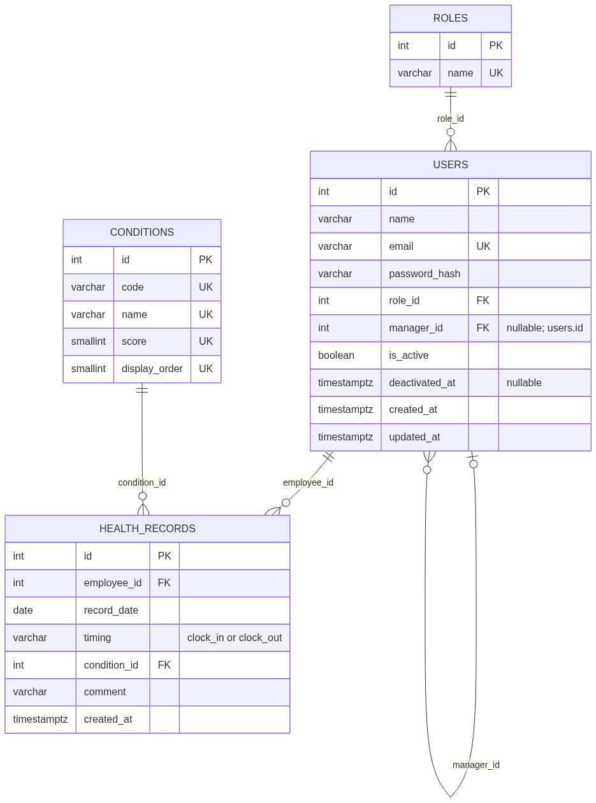
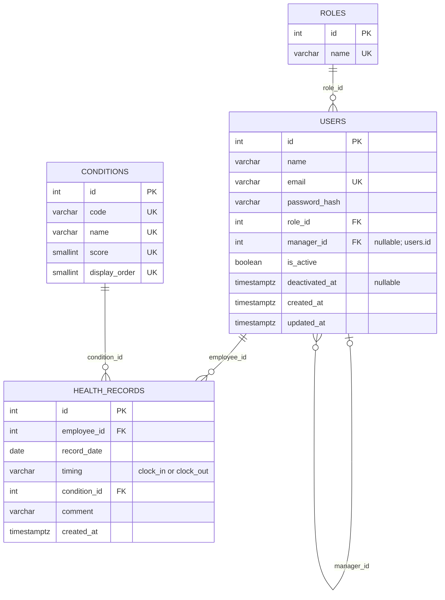

# HealthBridge システム構成・API／DB設計

## 1. 文書の位置づけ

本書は、現在の実装と、これから実装するMVPのAPI・DB設計案を分けて記録します。

- 参照資料：Googleドキュメント[「【Docs】体調管理・共有アプリ」](https://docs.google.com/document/d/1EKeJU0Jydtram7yDto50QVDMukCxzGgsQxHxHNcGDyk/edit?tab=t.0)の「要件定義・技術選定 v2（再レビュー用）」「画面設計 v2（再レビュー用）」「DB設計v2」「API設計v2」「2026.09.17MTG」
- 資料参照日：2026年9月18日
- 判断基準：第2回レビュー後の決定、Issue #110 / #112の反映内容、現在のコードをv2案より優先

API・DB設計は実装前の案です。現時点で実装済みのバックエンドAPIは `GET /health` だけであり、以下に並べる業務API、DBモデル、マイグレーション、認証・認可は未実装です。

## 2. 現在と予定のシステム構成

```text
利用者のWebブラウザ
        │
        ▼
Frontend: Next.js / React / TypeScript
配置: Vercel（公開中）
        │
        │ HTTP / JSON（接続予定）
        ▼
Backend: Go / GORM
現在: net/http + GET /health
予定: Ginによる業務API、Renderへ配置
        │
        │ SQL / GORM
        ▼
PostgreSQL
開発: Docker上
本番: Supabase上を予定
```

※バックエンドは未デプロイです。

## 3. コンポーネントと実装状態

| コンポーネント | 役割 | 現在の状態 |
| --- | --- | --- |
| フロントエンド | 利用者別画面、入力、一覧、グラフ、モック操作 | モックUI実装済み。業務API未接続 |
| モック状態管理 | 従業員・担当関係・体調記録の一時更新 | React Contextで実装。再読み込みで初期化 |
| バックエンド | 認証・認可、業務ルール、DB操作 | PostgreSQL接続と標準ライブラリHTTPサーバーのみ実装 |
| Health Check | HTTPプロセスの稼働確認 | `GET /health` 実装済み。DB疎通確認ではない |
| 業務API | アカウント・体調記録・担当関係の処理 | 設計済み・未実装 |
| 開発DB | ローカル開発データの保存 | Docker ComposeでPostgreSQLを構成、接続処理実装済み |
| 本番DB | 公開環境のデータ保存 | Supabase上のPostgreSQLを使用予定、未構築 |
| 認証・認可 | ロール・担当関係に基づく制御 | 未実装。ログイン、401、403は画面のみ |

## 4. API

### 4.1 実装済みAPI

| メソッド | パス | 目的 | 実装 |
| --- | --- | --- | --- |
| `GET` | `/health` | HTTPプロセスが応答できることを確認し、`200 OK` と本文 `OK` を返す | Go標準ライブラリ `net/http` で実装済み |

サーバー起動前にDB接続を行いますが、`GET /health` のハンドラー自体はDBへ問い合わせません。

### 4.2 MVPの業務API設計案（すべて未実装）

| API ID | メソッド | パス | 目的 | 役割・データ範囲 | 関連機能 |
| --- | --- | --- | --- | --- | --- |
| API-01 | `POST` | `/api/managers` | managerアカウントを作成 | 認証不要とする設計案。利用運用は要確認 | F-01 |
| API-02 | `POST` | `/api/auth/login` | メールアドレスとパスワードでログイン | 認証不要 | F-02 |
| API-03 | `POST` | `/api/auth/logout` | ログイン状態を終了 | ログイン済みユーザー | F-02 |
| API-04 | `POST` | `/api/employees` | employeeを作成し、実行者を担当managerに設定 | managerのみ | F-03 |
| API-05 | `GET` | `/api/employees/{employeeId}` | employeeの登録情報を取得 | managerのみ・自身の担当employeeに限定 | F-09 |
| API-06 | `PATCH` | `/api/employees/{employeeId}` | employeeの氏名・メールアドレス等を更新 | managerのみ・自身の担当employeeに限定 | F-13 |
| API-07 | `PATCH` | `/api/employees/{employeeId}/deactivate` | employeeを物理削除せず無効化 | managerのみ・自身の担当employeeに限定 | F-13 |
| API-08 | `POST` | `/api/health-records` | 出勤時または退勤時の体調を登録 | employeeのみ・本人の記録 | F-04 |
| API-09 | `GET` | `/api/health-records?period=week\|month` | 本人の体調記録を期間指定で取得 | employeeのみ・本人の記録 | F-05, F-06 |
| API-10 | `GET` | `/api/managed-employees?date=YYYY-MM-DD&filter=...` | 指定日の担当employee一覧と体調を取得 | managerのみ・自身の担当employee | F-07, F-08 |
| API-11 | `GET` | `/api/managed-employees/{employeeId}/health-records` | 担当employeeの体調履歴を取得 | managerのみ・自身の担当employeeに限定 | F-09 |
| API-12 | `GET` | `/api/managers` | 担当変更先となる有効manager一覧を取得 | managerのみ | F-10 |
| API-13 | `PATCH` | `/api/managed-employees/{employeeId}/manager` | 担当employeeを別managerへ引き継ぐ | managerのみ・現在の担当managerに限定 | F-10 |

担当関係は、作成時（API-04）、担当範囲の参照・更新（API-05〜07、10、11）、担当変更（API-12、13）にまたがります。画面に対象IDが含まれていても信用せず、API側でログインユーザーのroleと `users.manager_id` を照合する必要があります。

### 4.3 フロントエンドとAPI設計の未解消差分

業務APIは未実装のため、本対応ではどちらの値も変更していません。

| 対象 | 現在のフロントエンド | API／DB設計案 | 実装前に必要な判断 |
| --- | --- | --- | --- |
| 最上位の体調コード | `excellent` | `very_good` | API接続前に正規コードを統一する |
| 入力タイミング | `clockIn` / `clockOut` | `clock_in` / `clock_out` | DTO変換で吸収するか型を統一する |
| ID | 文字列（例：`"1"`、`new-...`） | `INTEGER` | API境界の型とモック置換方針を決める |
| 担当管理者 | 氏名文字列を状態に保存 | `users.manager_id` | manager IDを用いるレスポンス／表示変換を決める |
| manager自身の編集・削除 | 到達可能なモックUIあり | 対応API・要件なし | MVP要件へ追加するかUIを別Issueで整理する |

## 5. DB設計案（未実装）

DB設計v2を第2回レビュー後のMVPと照合した結果、チーム集計を外すためのテーブル削除・追加は不要です。グラフの色・線・横スクロールも表示上の変更であり、DB構造へ影響しません。

### 5.1 テーブル概要

| テーブル | 主なカラム | 主な制約・役割 |
| --- | --- | --- |
| `roles` | `id`, `name` | `name` は一意。初期値は `manager`, `employee` |
| `users` | `id`, `name`, `email`, `password_hash`, `role_id`, `manager_id`, `is_active`, `deactivated_at`, timestamps | `email` は一意。`role_id` → `roles.id`。`manager_id` → `users.id` の自己参照で現在の担当managerを表す |
| `conditions` | `id`, `code`, `name`, `score`, `display_order` | `code`, `name`, `score`, `display_order` はそれぞれ一意。5段階の固定値 |
| `health_records` | `id`, `employee_id`, `record_date`, `timing`, `condition_id`, `comment`, `created_at` | `employee_id` → `users.id`、`condition_id` → `conditions.id`。同一employee・日付・timingを一意にする |

### 5.2 重要な制約と業務ルール

- `users.manager_id` はnullableな自己参照とし、employeeの現在の担当managerを示す。manager自身は `NULL` とする設計案
- `health_records` に `UNIQUE (employee_id, record_date, timing)` を設定する
- `timing` は `CHECK (timing IN ('clock_in', 'clock_out'))` とする
- コメントは必須とし、`VARCHAR(500) NOT NULL` とする設計案
- 「未入力」は `conditions` に追加せず、該当する `health_records` が存在しない状態として判定する
- 「未入力」絞り込みは、指定日の `clock_in` が存在しないemployeeを対象とする仮仕様
- 担当変更時は `users.manager_id` を更新し、employeeアカウントと過去の体調記録を保持する
- employeeの無効化は `is_active = false` とし、物理削除しない

### 5.3 conditions初期データ案

| code | 画面表示 | score | display_order |
| --- | --- | ---: | ---: |
| `very_good` | とても良好 | 2 | 1 |
| `good` | 良好 | 1 | 2 |
| `normal` | 普通 | 0 | 3 |
| `caution` | 注意 | -1 | 4 |
| `bad` | 悪化 | -2 | 5 |


## 6. ER図（設計案・未実装）

mermaidで作成した暫定版です。今後の機能実装によって制約・カラム等を変更する可能性があります。



<details>
<summary>Mermaidソース</summary>



</details>

Mermaidの属性表現では複合一意制約を表しにくいため、`HEALTH_RECORDS` の `UNIQUE (employee_id, record_date, timing)` は本文とテーブル定義を正とします。

## 7. 今後の実装順序

1. フロントエンドとAPI設計のコード値・ID型を確定する
2. GORMモデルとマイグレーションを実装する
3. Ginを導入し、MVP業務APIを画面単位で実装する
4. 認証と、role・担当関係に基づくサーバー側認可を実装する
5. フロントエンドのモック状態をAPI接続へ置き換える
6. Render / Supabaseの構成と公開環境を整備する
7. API・DB・画面を通したテストとCIを整備する

機能・設計変更時はREADMEと関連docsも同じIssueで更新します。独立した設計変更や、本書に残したコード値・未定義UI等の不整合は、アプリ実装とは分けてIssueで追跡します。
