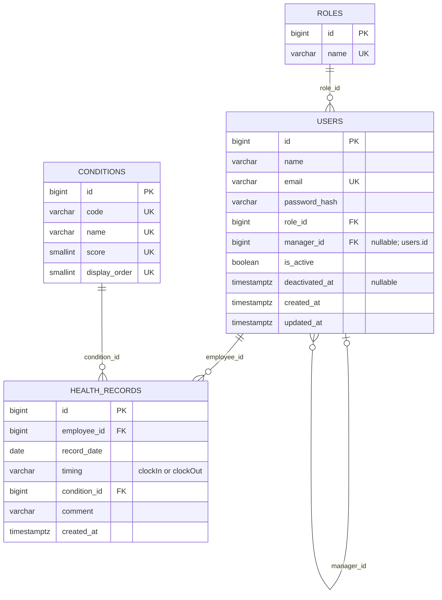

# HealthBridge システム構成・API／DB設計

## 1. 文書の位置づけ

本書は、現在の実装と、これから実装するMVPのAPI・DB設計を分けて記録します。実装前に確定した設計と、引き続き判断が必要な事項を明示します。

- 参照資料：Googleドキュメント[「【Docs】体調管理・共有アプリ」](https://docs.google.com/document/d/1EKeJU0Jydtram7yDto50QVDMukCxzGgsQxHxHNcGDyk/edit?tab=t.0)の「要件定義・技術選定 v2（再レビュー用）」「画面設計 v2（再レビュー用）」「DB設計v2」「API設計v2」「2026.09.17MTG」
- 資料参照日：2026年9月18日
- 判断基準：第2回レビュー後の決定、Issue #110 / #112の反映内容、現在のコードをv2案より優先

業務API設計は実装前のものです。DBモデル、マイグレーション、マスターデータは実装済みですが、現時点で実装済みのバックエンドAPIは `GET /health` だけであり、以下に並べる業務APIと認証・認可は未実装です。

## 2. 現在と予定のシステム構成

```text
利用者のWebブラウザ
        │
        ▼
Frontend: Next.js / React / TypeScript
配置: Vercel（公開中）
        │
        │ HTTP / JSON（接続予定）
        ▼
Backend: Go / Gin / GORM
現在: GET /health、共通middleware、graceful shutdown、DBモデル／マイグレーション
予定: Ginによる業務API、Renderへ配置
        │
        │ SQL / GORM
        ▼
PostgreSQL
開発: Docker上
本番: Supabase上を予定
```

※バックエンドは未デプロイです。

## 3. コンポーネントと実装状態

| コンポーネント | 役割 | 現在の状態 |
| --- | --- | --- |
| フロントエンド | 利用者別画面、入力、一覧、グラフ、モック操作 | モックUI実装済み。業務API未接続 |
| モック状態管理 | 従業員・担当関係・体調記録の一時更新 | React Contextで実装。再読み込みで初期化 |
| バックエンド | 認証・認可、業務ルール、DB操作 | Gin、PostgreSQL接続、共通middleware、graceful shutdown、DBモデル／マイグレーションまで実装 |
| Health Check | HTTPプロセスの稼働確認 | `GET /health` 実装済み。DB疎通確認ではない |
| 業務API | アカウント・体調記録・担当関係の処理 | 設計済み・未実装 |
| 開発DB | ローカル開発データの保存 | Docker ComposeでPostgreSQLを構成。4テーブルとマスターデータを明示コマンドで作成可能 |
| 本番DB | 公開環境のデータ保存 | Supabase上のPostgreSQLを使用予定、未構築 |
| 認証・認可 | ロール・担当関係に基づく制御 | 未実装。ログイン、401、403は画面のみ |

## 4. API

### 4.1 実装済みAPI

| メソッド | パス | 目的 | 実装 |
| --- | --- | --- | --- |
| `GET` | `/health` | HTTPプロセスが応答できることを確認し、`200 OK` とJSON `{"status":"ok"}` を返す | Ginで実装済み |

サーバー起動前にDB接続を行いますが、`GET /health` のハンドラー自体はDBへ問い合わせません。

ルーターは起動処理から分離しています。GinのLoggerとRecoveryを使用し、未定義ルートは `404`、panic時は `500` の安全なJSONを返します。内部エラーやSQL情報はレスポンスへ含めません。これらは現時点の基盤用レスポンスであり、業務API全体の共通エラーレスポンス形式は未確定です。

起動時に `DATABASE_URL` と `ALLOWED_ORIGINS` を必須環境変数として検証し、`PORT` は未指定時に `8080` を使用します。許可Originはカンマ区切りで明示し、ワイルドカードは受け付けません。現時点ではcredentialを許可せず、本番Cookie属性、CSRF方式、Vercel Preview URLの扱いは認証方式とあわせて別Issueで決定します。

HTTPサーバーはOSの終了シグナルを受けると10秒を上限にgraceful shutdownし、その後にDB接続を閉じます。起動失敗は通常停止と区別してエラーにします。

### 4.2 MVPの業務API設計案（すべて未実装）

| API ID | メソッド | パス | 目的 | 役割・データ範囲 | 関連機能 |
| --- | --- | --- | --- | --- | --- |
| API-01 | `POST` | `/api/managers` | managerアカウントを作成 | manager本人が登録。登録資格の確認方法は本番API実装前に決定 | F-01 |
| API-02 | `POST` | `/api/auth/login` | メールアドレスとパスワードでログイン | 認証不要 | F-02 |
| API-03 | `POST` | `/api/auth/logout` | ログイン状態を終了 | ログイン済みユーザー | F-02 |
| API-04 | `POST` | `/api/employees` | employeeを作成し、実行者を担当managerに設定 | managerのみ | F-03 |
| API-05 | `GET` | `/api/employees/{employeeId}` | employeeの登録情報を取得 | managerのみ・自身の担当employeeに限定 | F-09 |
| API-06 | `PATCH` | `/api/employees/{employeeId}` | employeeの氏名・メールアドレス等を更新 | managerのみ・自身の担当employeeに限定 | F-13 |
| API-07 | `PATCH` | `/api/employees/{employeeId}/deactivate` | employeeを物理削除せず無効化 | managerのみ・自身の担当employeeに限定 | F-13 |
| API-08 | `POST` | `/api/health-records` | 出勤時または退勤時の体調を登録 | employeeのみ・本人の記録 | F-04 |
| API-09 | `GET` | `/api/health-records?period=week\|month` | 本人の体調記録を期間指定で取得 | employeeのみ・本人の記録 | F-05, F-06 |
| API-10 | `GET` | `/api/managed-employees?date=YYYY-MM-DD&filter=...` | 指定日の担当employee一覧と体調を取得 | managerのみ・自身の担当employeeかつ `is_active = true` のemployeeに限定 | F-07, F-08 |
| API-11 | `GET` | `/api/managed-employees/{employeeId}/health-records` | 担当employeeの体調履歴を取得 | managerのみ・自身の担当employeeに限定 | F-09 |
| API-12 | `GET` | `/api/managers` | 担当変更先となる有効manager一覧を取得 | managerのみ | F-10 |
| API-13 | `PATCH` | `/api/managed-employees/{employeeId}/manager` | 担当employeeを別managerへ引き継ぐ | managerのみ・現在の担当managerに限定 | F-10 |

担当関係は、作成時（API-04）、担当範囲の参照・更新（API-05〜07、10、11）、担当変更（API-12、13）にまたがります。画面に対象IDが含まれていても信用せず、API側でログインユーザーのroleと `users.manager_id` を照合する必要があります。

API-14「チーム体調傾向」は現行MVPから除外済みのため、業務APIへ追加しません。機能IDと同様にAPI IDも別機能へ再利用しません。

### 4.3 API共通表現（確定・未実装）

- APIのリクエスト・レスポンスではIDを文字列として表現する
- パスパラメータも文字列として受け取り、バックエンドで妥当な整数IDへ変換・検証してからDB処理に使用する
- DBの主キーは整数とし、APIの文字列IDとは境界で明示的に変換する
- conditionコードは `excellent`、`good`、`normal`、`caution`、`bad` とする
- timingは `clockIn`、`clockOut` とする。DBの識別子はsnake_caseを維持するが、`health_records.timing` に保存する値も同じコードを使用する
- managerの表示が必要なレスポンスでは、少なくとも文字列の `id` と `name` を持つオブジェクトを返す

```json
{
  "id": "1",
  "name": "鈴木 花子"
}
```

モック固有の `new-...` 形式のIDや固定ユーザーID `"1"` は、実API接続後には使用しません。認証済みユーザーのIDとrole、現在の担当managerはサーバー側で特定し、クライアントから送信されたroleやmanager IDを認証・認可の根拠にしません。

### 4.4 フロントエンドとAPI・DB設計の整合方針

現在のフロントエンドで使用する型・値を維持しつつ、モック固有の表現を本番設計へ持ち込まないよう、次の方針で統一します。

| 対象 | 確定した設計 | モックからの置き換え方針 |
| --- | --- | --- | --- |
| 最上位の体調コード | API・DBとも `excellent` | フロントエンドの既存コードをそのまま使用する |
| 入力タイミング | API・DBの保存値とも `clockIn` / `clockOut` | フロントエンドの既存コードをそのまま使用する |
| ID | DBは整数、APIは文字列 | `new-...` を廃止し、APIが返すIDへ置き換える |
| 担当manager | DBは `users.manager_id`、表示APIは `{ id, name }` | 氏名文字列だけの関連付けを廃止し、IDで識別する |

次の事項は本対応では確定せず、関連APIの実装前に別途判断します。

- manager登録資格の確認方法
- 認証・セッション方式とCookie、CORS、CSRFの方針
- 共通エラーレスポンス形式
- `record_date`、日付境界、タイムゾーン、期間指定の詳細
- 無効化後の履歴参照、担当変更履歴、同時更新の扱い
- デモデータ、本番データの投入方法とRender／Supabase構成
- manager自身の編集・削除UIと、到達不能な従業員検索・追加ダイアログのMVP上の扱い

## 5. DB設計（実装済み）

DB設計v2を第2回レビュー後のMVPと照合し、次の4テーブルをGORMモデルとPostgreSQLスキーマとして実装しています。チーム集計用テーブル、担当変更履歴、認証用テーブルは追加していません。

### 5.1 テーブル概要

| テーブル | 主なカラム | 主な制約・役割 |
| --- | --- | --- |
| `roles` | `id`, `name` | `name` は一意。初期値は `manager`, `employee` |
| `users` | `id`, `name`, `email`, `password_hash`, `role_id`, `manager_id`, `is_active`, `deactivated_at`, timestamps | `email` は一意。`role_id` → `roles.id`。`manager_id` → `users.id` の自己参照で現在の担当managerを表す。氏名文字列では関連付けない |
| `conditions` | `id`, `code`, `name`, `score`, `display_order` | `code`, `name`, `score`, `display_order` はそれぞれ一意。5段階の固定値 |
| `health_records` | `id`, `employee_id`, `record_date`, `timing`, `condition_id`, `comment`, `created_at` | `employee_id` → `users.id`、`condition_id` → `conditions.id`。同一employee・日付・timingを一意にする |

### 5.2 重要な制約と業務ルール

- PostgreSQLの各テーブルの主キーは整数とする。GORMモデルでは `uint`、PostgreSQLでは `bigint` として実装し、APIではIDを文字列として返してDBアクセス前に変換・検証する
- `users.manager_id` はnullableな自己参照とし、employeeの現在の担当managerを示す。manager自身は `NULL` とする
- `health_records` に `UNIQUE (employee_id, record_date, timing)` を設定する
- `timing` は `CHECK (timing IN ('clockIn', 'clockOut'))` とする
- コメントは必須とし、`VARCHAR(500) NOT NULL` とする
- 「未入力」は `conditions` に追加せず、該当する `health_records` が存在しない状態として判定する
- 「未入力」絞り込みは、指定日の `clockIn` が存在しないemployeeを対象とする仮仕様
- 担当変更時は `users.manager_id` を更新し、employeeアカウントと過去の体調記録を保持する
- employeeの無効化は `is_active = false` とし、物理削除しない

### 5.3 conditions初期データ

| code | 画面表示 | score | display_order |
| --- | --- | ---: | ---: |
| `excellent` | とても良好 | 2 | 1 |
| `good` | 良好 | 1 | 2 |
| `normal` | 普通 | 0 | 3 |
| `caution` | 注意 | -1 | 4 |
| `bad` | 悪化 | -2 | 5 |

`roles`には `manager`、`employee` を投入します。マスターデータは一意キーを使ったUPSERTで投入し、複数回実行しても重複しません。デモユーザーとデモ体調記録は投入しません。

### 5.4 マイグレーション

HTTPサーバー起動時には自動マイグレーションを行いません。Docker ComposeでDBを起動した後、次の専用コマンドを明示的に実行します。

```bash
docker compose run --rm backend /usr/local/bin/migrate
```

このコマンドはGORMのマイグレーションとマスターデータ投入を同じトランザクションで実行します。テーブル、外部キー、NOT NULL、一意、CHECK、文字数の各制約はPostgreSQL上の統合テストで確認します。外部キー列には索引を設定し、`health_records`の複合一意索引はemployee別・日付順の取得にも利用できる並びにしています。

## 6. ER図（実装済み）

実装した4テーブルの関係を示します。今後の機能実装によって制約・カラム等を変更する場合は、モデル、マイグレーション、本文、図を同時に更新します。

画像はテーブル間の関係を示す既存の構造図です。今回確定したコード値はDB構造を変えないため画像ファイルは更新せず、timingの値は5.2と以下のMermaidソースを正とします。


<details>
<summary>Mermaidソース</summary>



</details>

Mermaidの属性表現では複合一意制約を表しにくいため、`HEALTH_RECORDS` の `UNIQUE (employee_id, record_date, timing)` は本文とテーブル定義を正とします。

## 7. 今後の実装順序

1. 確定したcondition・timingコード、ID境界、manager表現に基づいてDTOと入力検証を定義する
2. Gin上へMVP業務APIを画面単位で実装する
3. 認証と、role・担当関係に基づくサーバー側認可を実装する
4. フロントエンドのモック状態をAPI接続へ置き換える
5. Render / Supabaseの構成と公開環境を整備する
6. API・DB・画面を通したテストとCIを整備する

機能・設計変更時はREADMEと関連docsも同じIssueで更新します。独立した設計変更や、本書に残した未確定事項・未定義UI等の不整合は、アプリ実装とは分けてIssueで追跡します。
